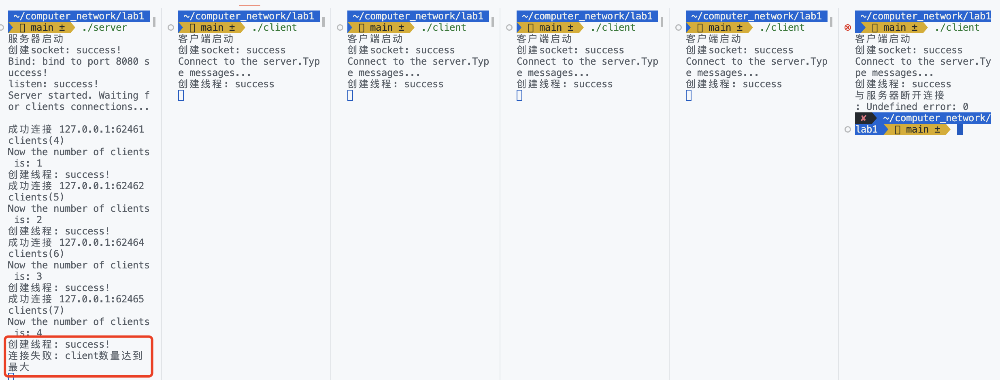

<h1><center>计算机网络实验报告</center></h1>

<h3><center>lab1:利用Socket编写一个聊天程序</center></h3>

<h5><center>2112614 刘心源</center></h5>

# 一、前期准备

### 实验环境

系统配置：MacOS（arm64）+Vscode

使用的库如下：

```c
#include <stdio.h>
#include <stdlib.h>
#include <string.h>
#include <unistd.h>
#include <arpa/inet.h>
#include <pthread.h>
#include <errno.h>
```

使用命令行编译运行：

```bash
//服务器端
gcc server.c -o server -lpthread    
./server

//客户端
gcc client.c -o client  
./client
```


# 二、协议设计

##### 套接字：Socket

计算机网络中用于实现不同计算机间或同一计算机内的进程间通信的一种技术。它提供了一个标准的API接口，使得应用程序可以使用网络协议（如TCP/IP）进行通信。

###### 流式套接字：Stream Sockets

使用`TCP`（传输控制协议）进行通信，提供了一个可靠的、双向的、基于连接的字节流。这意味着数据按照发送的顺序到达，并且不会丢失或重复。


##### 网络协议

网络协议是一组预定义的规则和约定，用于控制计算机或其他网络设备在网络上的通信。这些规则确保了数据在发送和接收时的正确性、完整性和及时性。

###### 网络协议的三要素

网络协议的三要素是描述和定义协议核心特性的三个基本组成部分：

1. **语法（Syntax）**:
   - 描述数据的结构和格式。
   - 定义如何组织和表示数据，例如数据包的头部和尾部、字段的长度、数据的编码方式等。
   - Tips：`IPv4`地址由四个字节组成，每个字节之间用点（.）分隔。
2. **语义（Semantics）**:
   - 描述数据的意义和解释。
   - 定义数据的操作、指示、命令和其他功能。
   - Tips：`HTTP`协议中的`GET`请求表示要从服务器检索信息，而`POST`请求表示要向服务器发送数据。
3. **时序（Timing）**:
   - 描述数据交换的顺序和时间要求。
   - 定义事件发生的顺序、数据包的发送和接收速率、超时和重试策略等。
   - Tips：`TCP`协议中的三次握手过程定义了建立连接的顺序和时间要求。


###### TCP协议的三要素

> TCP（传输控制协议）是一种面向连接的、可靠的、基于字节流的传输层通信协议。以下是TCP协议的语法、语义和时序的简要描述：
>
> ##### 1. **语法（Syntax）**
>
>    - **头部格式**：TCP头部包含了源端口、目的端口、序列号、确认号、头部长度、标志位（如SYN, ACK, FIN等）以及其他的控制信息。
>    - **数据格式**：TCP没有对数据格式做特定的规定，它可以传输任何形式的字节流数据。
>
> ##### 2. **语义（Semantics）**
>
>    - **连接管理**：TCP提供了连接的建立和终止的机制。通过三次握手（3-way handshake）来建立连接，通过四次挥手（4-way handshake）来终止连接。
>    - **可靠性**：TCP通过序列号、确认应答（ACK）、超时重传等机制来确保数据的可靠传输。
>    - **流量控制**：TCP使用滑动窗口机制来进行流量控制，以避免发送方发送数据的速度超过接收方接收数据的速度。
>    - **拥塞控制**：TCP还包括拥塞控制机制，以避免网络拥塞。
>
> ##### 3. **时序（Timing）**
>
>    - **连接建立（Three-way Handshake）**
>      1. 客户端发送SYN包到服务器，请求建立连接。
>      2. 服务器回应一个SYN-ACK包，确认连接请求。
>      3. 客户端发送ACK包，完成连接的建立。
>
>    - **数据传输**
>      - 数据在连接建立后可以在两个方向上流动，每个方向都有相应的序列号和确认号。
>
>    - **连接终止（Four-way Handshake）**
>      1. 一方（可以是客户端或服务器）发送FIN包，请求关闭连接。
>      2. 另一方回应ACK包，确认接收到关闭请求。
>      3. 另一方在传输完剩余数据后，也发送FIN包。
>      4. 第一方回应ACK包，完成连接的终止。
>


##### 聊天程序协议

本聊天程序是在TCP协议的基础上设计的。在本聊天程序中，我们设计**协议**如下：

本程序实现一个多人聊天程序：

1. 使用流式套接字，使用多线程
2. 程序包括客户端与服务器端
3. 服务器端支持与客户端相连接
   - 设置最大连接数，当超过最大连接数时，服务器不支持连接；
   - 对于每个连接的客户端，服务器都会创建一个新的线程来处理该客户端的消息。
   - 服务器接收到客户端的消息后，将消息打上时间标签，并广播到所有其他已连接的客户端，每条消息在服务器端都会被记录到日志中。
   - 服务器实时检测与每个客户端的连接状态。如果发现某个客户端已断开连接，服务器会：
     - 立即回收与该客户端相关的所有资源；
     - 如果当前在线的客户端数量还没有达到上限，服务器将继续接受新客户端的连接请求。

4. 客户端与服务器端建立连接
   - 客户端使用两个线程：
     - 一个线程用于输入和发送消息
     - 一个线程用于接收服务器的消息并打印
   - 客户端实时检测是否与服务器建立连接，如果连接异常，例如由于网络问题或对方关闭连接，客户端会关闭相应的`SOCKET`并处理异常。
   - 客户端可以自行关闭：
     - 客户端可以输入`EXIT`或直接关闭程序来断开连接，关闭`SOCKET`。
5. 消息
   - 消息是文本格式，设置有最大长度，不允许输入超过最大长度的字符串；
   - 收发消息保存在字符数组类型的缓冲区中；
   - 消息以换行符\n结尾，允许在一条消息中输入空格；


按照类别进行分类～：

- 消息类型：中英文文本消息
- 语法：每条消息以`\n`结尾作为结束标志
- 语义：
  - 消息被直接发送到服务器，服务器负责将消息广播到所有连接的客户端；
  - 只有输入`EXIT`时客户端退出，没有其他特定的命令or控制消息
- 时序
  - 客户端首先建立与服务器的连接。
  - 连接建立后，客户端可以开始发送消息到服务器。
  - 服务器接收到消息后，将其广播到所有已连接的客户端。
  - 客户端接收到消息后，直接在用户界面上显示。


# 三、设计思路

#### 服务器端

1. **初始化**
   - 导入必要的头文件和库，定义全局变量和常量，如服务器和客户端的sockets、地址结构体、客户端sockets的数组、客户端数量和状态等。
2. **创建服务器Socket**
   - 使用 `socket()` 函数创建服务器端socket。
3. **绑定bind**
   - 使用 `bind()` 函数，初始化服务器IP地址和端口号，并将该地址绑定到服务器socket。
4. **监听listen**
   - 使用 `listen()` 函数，使socket进入监听状态，等待客户端的连接请求。
5. **接受客户端的连接请求**
   - 使用一个 `while`循环，当当前连接数<最大连接数时：
     - 使用 `accept()` 函数接受一个特定socket请求等待队列中的连接请求，并将其返回的新socket赋值给预先设定好的socket队列。
     - 使用 `pthread_create()` 函数为每个连接创建一个新线程，每个连接（线程）进入 `handle_client` 线程函数。
6. **处理客户端的请求（`handle_client` 线程函数）**
   - 使用一个 `while`循环，持续接收和处理客户端的消息：
     - 使用 `recv()` 函数接收客户端的消息。
     - 如果 `recv`函数返回正常：
       - 获取当前时间标签。
       - 将收到的消息打上时间标签后，使用 `send()` 函数发送给所有客户端。
     - 如果 `recv`函数返回异常：
       - 检查错误代码，如果是特定的错误代码（如客户端主动关闭了连接），则直接打印输出连接关闭的信息。
       - 使用 `close()` 函数关闭该线程所对应的客户端的socket。
7. **关闭服务器Socket**
   - 最后，使用 `close()` 函数关闭服务器的socket，并释放所有相关资源。


#### 客户端

1. **初始化**
   - 导入必要的头文件和库，定义全局变量和常量，如客户端的socket、地址结构体等。

2. **创建客户端Socket**
   - 使用 `socket()` 函数创建客户端socket。

3. **连接到服务器connect**
   - 使用 `connect()` 函数，初始化服务器的IP地址和端口号，并尝试连接到服务器。

4. **发送和接收消息**
   - 创建一个新线程用于接收服务器发送的消息。在这个线程中：
     - 使用一个 `while` 循环，持续接收服务器的消息。
     - 使用 `recv()` 函数接收消息，并在客户端控制台输出。
   - 在主线程中：
     - 使用一个 `while` 循环，持续获取用户在控制台的输入。
     - 使用 `send()` 函数发送用户输入的消息到服务器。

5. **处理 "EXIT" 命令**
   - 如果用户输入 "EXIT"，则跳出发送消息的 `while` 循环。
   - 关闭客户端的socket，并退出程序。

6. **错误处理**
   - 在各个阶段（如socket创建、连接服务器、接收和发送消息等）都有错误处理代码，以打印相应的错误消息并在必要时退出程序。

7. **关闭客户端Socket**
   - 使用 `close()` 函数关闭客户端的socket，并释放所有相关资源。在用户输入 "EXIT" 或接收到错误时执行此操作。


# 四、代码实现

### 1.服务器端

##### 编程中遇到的问题

在进行服务器端编写的时候，比较麻烦的是如何去维护`client_sockets`数组（存储所有连接的客户端socket），因为客户端的在线状态是不断变动的。

一种比较简单的方式就是在一个客户端下线的时候去移动整个数组：

```c
for (int i = 0; i < client_count; i++) {
  if (client_sockets[i] == sock) {
    for (int j = i; j < client_count - 1; j++) {
      client_sockets[j] = client_sockets[j + 1];
    }
    client_count--;
    break;
  }
}
```

但是这样子的做法是有问题的，会出现以下问题：在连接了三个客户端之后，如果有一个客户端退出（EXIT），再有新客户端上线，则原有客户端之间不能互相通信。原因就是出现了两个客户端共用一个socket的情况。当新的客户端连接到服务器时，新客户端可能会被分配到已经被之前客户端使用过的socket描述符。因为在Unix-like系统中，文件描述符会被重新使用。

因此，为了解决这个问题，我加入了`client_socket_status`数组，用来记录`client_sockets`数组位置的利用情况，编写以下代码：

```c
int client_status(){
    for(int i=0;i<MAX_CLIENTS;i++){
        if(client_sockets_status[i] == 0) return i;
    }
    return -1;
}
```

<h6><center>返回client_socket数组中为空的位置</center></h6>

```c
int temp = client_status();//返回数组中的空位；
client_sockets_status[temp] = 1;
client_sockets[temp] = new_socket;
client_count++;
//打印一条消息，显示已接受的客户端的IP地址和端口号。
printf("成功连接 %s:%d clients(%d)\n", inet_ntoa(client_addr.sin_addr), ntohs(client_addr.sin_port),new_socket);
printf("Now the number of clients is: %d\n",client_count);
```

<h6><center>客户端请求连接</center></h6>

```c
if(strcmp(Recvbuffer, "EXIT") == 0 || read_size == 0){
  for(int i=0;i<MAX_CLIENTS;i++){
    if(client_sockets[i]==sock) {
      printf("Client %d exit, number of current clients: %d.\n", sock, client_count-1);
      client_sockets_status[i]=0;
      client_sockets[i]=0;
      client_count=client_count-1;

      //关闭客户端的socket，释放分配的内存，并结束线程
      close(sock);
      free(client_socket);
      return NULL;
    }
  }
}
```

<h6><center>客户端退出连接</center></h6>

当有客户端请求连接时，使用`client_status`函数返回此时`client_socket`数组中处于空闲的位置i并将其使用状态`client_socket_status[i]`标记为1；如果有客户端退出聊天时，查找到这个客户端的socket在数组中的位置并将其使用状态标记为0，关闭socket。此时可以解决刚刚提出的问题，但是会多耗费一些时间，特别是在客户端数量很大的情况下。

##### 如何观察是否有数据包丢失

在代码中插入大量的错误检测代码，如

```c
printf("client %d: %s  Bytes:%d\n", sock ,Recvbuffer,read_size);

if(read_size == -1)
{
  perror("recv failed");
  close(sock);
  free(client_socket);
  return NULL;
}
```

并输出相关日志，由此可以发现可能的数据丢失问题

##### 其他功能的实现

1. 使用的全局变量

   ```c
   const int PORT=8080; // 服务器监听的端口号
   #define BUFFER_SIZE 2048 //消息缓冲区大小,缓冲区用来存放客户端发来的消息，每个客户端对应一个缓冲区
   #define MAX_CLIENTS 4 //最大客户端数量，可以进行更改
   
   //定义了服务器的socket、新连接的客户端的socket
   //两个地址结构体来存储服务器和客户端的地址信息。
   int server_socket, new_socket, *new_sock;
   struct sockaddr_in server_addr, client_addr;
   socklen_t addr_size;
   
   int client_sockets[MAX_CLIENTS];// client_sockets存储所有连接的客户端的套接字
   int client_count = 0;//使用client_count来跟踪当前连接的客户端数量
   int client_sockets_status[MAX_CLIENTS];//记录当前的socket数组位置是否为空
   ```

2. 一些辅助函数

   ```c
   int client_status(){
       for(int i=0;i<MAX_CLIENTS;i++){
           if(client_sockets_status[i] == 0) return i;
       }
       return -1;
   }
   
   void add_info(char* message){
       time_t rawtime;
       struct tm * timeinfo;
       char time_stamp[80];
       //获取当前时间
       time(&rawtime);
       timeinfo = localtime(&rawtime);
       //格式化时间
       strftime(time_stamp, sizeof(time_stamp), "%Y-%m-%d %H:%M:%S", timeinfo);
       //添加时间戳
       strcat(time_stamp, ": ");
       strcat(time_stamp, "\n");
       strcat(time_stamp, message);
       //将带有时间戳的消息复制回原来的消息变量
       strcpy(message, time_stamp);
   }
   ```

   `client_status`前面已经解释过，不再赘述；`add_info`是为客户端发送的消息添加时间戳。

3. 线程函数`handle_client`

   ```c
   //一个线程函数，用于处理客户端的消息
   void *handle_client(void *client_socket) 
   {
       int sock = *(int *)client_socket; //获取客户端的socket
       char Recvbuffer[BUFFER_SIZE]; //接受消息的缓冲区
       char Sendbuffer[BUFFER_SIZE]; //发送消息的缓冲区
       int read_size; //存储接收到的消息的大小
   
       while((read_size=recv(sock, Recvbuffer, BUFFER_SIZE, 0))>0)
       {
           //接收客户端的消息并转发给其他客户端
           Recvbuffer[read_size] = '\0';//消息字符串以空字符结尾
           //如果客户端发来的消息是EXIT，则退出
           if (strcmp(Recvbuffer, "EXIT") == 0) {
               break;
           }
           //将消息添加时间戳
           add_info(Recvbuffer);
         	//在服务器端的终端输出消息记录
           printf("client %d: %s \n", sock ,Recvbuffer);
           sprintf(Sendbuffer, "client %d: %s", sock,Recvbuffer);
   
           //================== 向其他socket都发送消息 =================
           for (int i = 0; i < MAX_CLIENTS; i++) {
               if (client_sockets_status[i] == 1 && client_sockets[i] != sock) {
                   int send_result = send(client_sockets[i], Sendbuffer, strlen(Sendbuffer), 0);
                   if (send_result <= 0) { // 如果发送失败，更新客户端sockets的状态
                       printf("Client %d disconnected unexpectedly.\n", client_sockets[i]);
                       client_sockets_status[i] = 0;
                       client_sockets[i] = 0;
                       client_count--;
                   }
               }
           } 
       }     
       if(strcmp(Recvbuffer, "EXIT") == 0 || read_size == 0){
           for(int i=0;i<MAX_CLIENTS;i++){
               if(client_sockets[i]==sock) {
                   printf("Client %d exit, number of current clients: %d.\n", sock, client_count-1);
                   client_sockets_status[i]=0;
                   client_sockets[i]=0;
                   client_count=client_count-1;
   
                   //关闭客户端的socket，释放分配的内存，并结束线程
                   close(sock);
                   free(client_socket);
                   return NULL;
               }
           }
       }
       if(read_size == -1)
       {
           perror("recv failed");
           close(sock);
           free(client_socket);
           return NULL;
       }
       return NULL;
   }
   ```

   这个线程函数主要用于处理客户端发送的消息。分为几种情况：

   - 如果客户端发送的消息字节数大小>0，此时应当接受客户端的消息。
     - 如果客户端发送的消息是“EXIT”，则跳出while循环；
     - 其余消息在进行处理之后向所有除自己外的客户端进行发送，如果发送失败，则证明该客户端连接出现问题，进行错误处理
   - 如果客户端发送的消息是“EXIT”，或者客户端终端被`ctrl+c`强行终止（不推荐这样😊）此时则维护`client_socket`数组，将这个客户端的socket关闭并释放分配的内存，同时结束线程。
   - 如果在接受数据时出现了异常与错误，此时read_size == -1，则输出一个错误消息。

4. 主函数`main()`

   ```c
   int main() {
       printf("服务器启动\n");
   
       //创建一个新的socket来监听客户端的连接请求。如果创建失败，则打印错误消息并退出程序。
       server_socket = socket(AF_INET, SOCK_STREAM, 0);//创建一个TCP套接字,AF_INET表示IPv4，SOCK_STREAM是套接字类型，0表示使用默认的套接字对应协议TCP
       if (server_socket == -1) {
           perror("创建socket: failed!\n");
           exit(EXIT_FAILURE);
       }
       printf("创建socket: success!\n");
   
       //=====================初始化服务器地址============================
       //设置服务器地址结构体的属性。这里，服务器监听所有可用的接口上的指定端口。
       server_addr.sin_family = AF_INET;//AF_INET表示IPv4
       server_addr.sin_addr.s_addr = INADDR_ANY;//INADDR_ANY表示服务器监听所有可用的接口上的指定端口
       server_addr.sin_port = htons(PORT);//htons()函数将主机字节序转换为网络字节序,PORT为服务器监听的端口号,htons(PORT)是将PORT转换为网络字节序
   
       //=====================bind=============================
       //将socket绑定到指定的地址和端口。如果绑定失败，则打印错误消息并退出程序
       int Bindtemp = bind(server_socket, (struct sockaddr *)&server_addr, sizeof(server_addr));
       if (Bindtemp < 0) {
           perror("Bind: failed\n");
           exit(EXIT_FAILURE);
       }
       printf("Bind: bind to port %d success!\n",PORT);
   
       //=========================listen=========================
       //开始监听客户端的连接请求，并打印一条消息表示服务器已启动。
       int ListenTemp = listen(server_socket, MAX_CLIENTS);
       if(ListenTemp != 0){
           perror("listen: failed!\n");
           exit(EXIT_FAILURE);
       }
       printf("listen: success!\n");
       printf("Server started. Waiting for clients connections...\n\n");
   
       //=========================接收client=======================
       //设置addr_size为sockaddr_in结构体的大小，这将在接受新的客户端连接时使用
       addr_size = sizeof(struct sockaddr_in);
       //用于持续接受来自client的连接请求。当有新的client尝试连接时，accept函数会返回一个新的socket
       while ((new_socket = accept(server_socket, (struct sockaddr *)&client_addr, &addr_size))) {
           if (client_count >= MAX_CLIENTS) {//如果客户端数量超过最大值，则拒绝连接
               printf("连接失败: client数量达到最大 \n");
               close(new_socket);
               continue;
           }
           
           int temp = client_status();//返回数组中的空位；
           client_sockets_status[temp] = 1;
           client_sockets[temp] = new_socket;
           client_count++;
           //打印一条消息，显示已接受的客户端的IP地址和端口号。
           printf("成功连接 %s:%d clients(%d)\n", inet_ntoa(client_addr.sin_addr), ntohs(client_addr.sin_port),new_socket);
           printf("Now the number of clients is: %d\n",client_count);
   
           //新建线程，并为新的socket分配内存
           pthread_t client_thread;
           new_sock = malloc(sizeof(int));
           *new_sock = new_socket;
   
           //创建一个新的线程来处理新的客户端的消息。如果创建线程失败，则打印错误消息并退出程序。
           if (pthread_create(&client_thread, NULL, handle_client, (void *)new_sock) < 0) {
               perror("创建线程: failed!\n");
               exit(EXIT_FAILURE);
           }
           printf("创建线程: success!\n");
       }
   
       //检查accept函数是否出现错误。如果出现错误，则打印错误消息并退出程序
       if (new_socket < 0) {
           perror("Accept failed");
           exit(EXIT_FAILURE);
       }
       close(server_socket);
   
       return 0;
   }
   ```

   主函数包括上面设计思路的几部分：create,bind,listen,receive等。

   

### 2.客户端

##### 实现功能

1. 全局变量以及其他变量

   ```c
   //定义了服务器的端口号和缓冲区大小
   const int PORT= 8080;
   #define BUFFER_SIZE 2048
   
   //定义客户端client，服务器地址结构和消息缓冲区
   int client_socket;
   struct sockaddr_in server_addr;
   ```

2. 线程函数`receive_messages(void *socket)`

   ```c
   //为接收服务器消息的线程设计的。它接受一个socket作为参数。
   void *receive_messages(void *socket) {
       int sock = *(int *)socket;
       while(1)
       {
           char buffer[BUFFER_SIZE];
           int read_size=recv(sock, buffer, BUFFER_SIZE, 0);
           if(read_size<=0)//如果接收到的字符数小于0，就退出
           {
               perror("与服务器断开连接\n");
               exit(EXIT_FAILURE);
               break;
           }
           else{//如果接收到的字符数大于0，就打印出来
               buffer[read_size] = '\0';
               printf("%s\n", buffer);
           }
       }
       return NULL;
   }
   ```

   这个线程函数运行在一个单独的线程中，持续接收来自服务器的消息。

   - 使用 `recv()` 函数从服务器接收消息。如果 `recv()` 函数返回值 `read_size <= 0`，表示接收消息时出现错误或服务器关闭了连接。此时，函数会输出错误消息并退出。
   - 如果成功接收到消息（`read_size > 0`），函数会在终端打印接收到的消息。

3. 主函数`main()`

   ```c
   int main() {
       //定义客户端client，服务器地址结构和消息缓冲区
       int client_socket;
       struct sockaddr_in server_addr;
   
       printf("客户端启动\n");
   
       ////==================创建客户端的socket=======================
       //创建一个新的socket。如果创建失败，打印错误消息并退出程序
       client_socket = socket(AF_INET, SOCK_STREAM, 0);
       if (client_socket == -1) {
           perror("创建socket: failed\n");
           return -1;
       }
       printf("创建socket: success\n");
   
       //=========================服务器地址=========================
       //设置服务器地址结构。这里，客户端尝试连接到本地地址127.0.0.1和之前定义的端口号
       server_addr.sin_family = AF_INET;
       server_addr.sin_addr.s_addr = inet_addr("127.0.0.1");
       server_addr.sin_port = htons(PORT);
   
       //=========================连接到服务器=========================
       //连接到服务器。如果连接失败，打印错误消息并退出程序
       if (connect(client_socket, (struct sockaddr *)&server_addr, sizeof(server_addr)) < 0) {
           perror("connect: failed\n");
           exit(EXIT_FAILURE);
       }
       printf("Connect to the server.Type messages...\n");
   
       //=========================创建线程=========================
       //创建一个新的线程来接收服务器的消息。如果创建线程失败，打印错误消息并退出程序。
       pthread_t receive_thread;
       if (pthread_create(&receive_thread, NULL, receive_messages, (void *)&client_socket) < 0) {
           perror("创建线程: failed\n");
           exit(EXIT_FAILURE);
       }
       printf("创建线程: success\n");
   
       //=========================发送消息=========================
       //持续从标准输入读取消息并发送给服务器，如果输入EXIT就退出循环
       while (1) {
           char buffer[BUFFER_SIZE] = {0};
           fgets(buffer, BUFFER_SIZE, stdin);
           buffer[strcspn(buffer, "\n")] = '\0';  // Remove newline
           send(client_socket, buffer, strlen(buffer), 0);
           if (strcmp(buffer, "EXIT") == 0) {
               printf("退出聊天室\n");
               break;
           }
       }
   
       close(client_socket);
       return 0;
   }
   ```

   主函数包括上面设计思路的各个部分，并在每部分都进行错误处理。


# 五、程序运行

#### 双人聊天

1. 打开服务器端server，会出现操作日志：

   

2. 打开两个客户端：

   

   - 服务器端：分别打印出两个客户端的连接信息；
   - 客户端：分别打印出操作日志；

3. 开始聊天

   

   - 服务器端：打印聊天记录
   - 客户端：
     - 键入消息并按下回车发送
     - 接收并显示除自己外的客户端的消息以及时间

4. 退出聊天

   

   - 服务器端：打印客户端退出的日志
   - 客户端显示退出程序

5. 关闭服务器

   

   - 客户端显示连接失败，输出错误消息


#### 多人聊天

设定最大连接数为4

```c
#define MAX_CLIENTS 4 //最大客户端数量
```

1. 测试连接数

   

   - 开启5个客户端，第5个客户端开启失败

   - 服务器端：输出错误日志；

2. 多人聊天测试

   

   - 开启4个客户端，互相发消息进行通信
   - 客户端：每个客户端都可以发送消息，并且可以收到其他所有客户端的消息
   - 服务器端：打印出所有消息记录

3. 用户退出

   

   

   - 在第1个客户端中输入EXIT，退出第1个客户端
   - 服务器端：打印退出日志
   - 客户端：其余客户端的通信不受影响

4. 用户加入

   

   

   - 加入新用户
   - 服务器端：打印新客户端连接日志
   - 客户端：加入聊天，且几个客户端聊天正常


# 六、实验中发现的其他东西

#### Q1:client_socket好像一直都是4，5，6，7呀

A1:在Unix-like系统（包括Linux和macOS）中，当一个进程启动并运行时，它会自动打开三个文件描述符：标准输入（stdin，文件描述符为0）、标准输出（stdout，文件描述符为1）和标准错误（stderr，文件描述符为2）。

当服务器进程创建新的socket时，该socket会获得最小可用的文件描述符。因此，第一个socket通常会获得文件描述符3，下一个会获得4，以此类推。

在我代码中，服务器首先创建了一个监听socket，它应该是获得了文件描述符3（这取决于进程在此之前是否打开了其他文件或sockets）。随后，当新的客户端连接到服务器时，每个新的客户端socket都会获得下一个可用的文件描述符。

并且，每次启动服务器并接受新的客户端连接时，这些文件描述符都会**从最小的可用数字开始分配**。


#### Q2：一开始对于这些线程有些许不理解

服务器和客户端都使用多线程来管理网络通信。

*服务器端*：

- **主线程** 主要负责监听新的客户端连接。一旦有新的客户端连接，它会创建一个新的线程来处理与该客户端的通信。
- **子线程** 每个子线程负责处理与一个特定客户端的通信。它会接收来自客户端的消息，并将这些消息广播到所有其他客户端。

*客户端*：

- **主线程** 主要负责从用户获取输入（例如，聊天消息）并将这些消息发送到服务器。
  
- **子线程** 负责接收来自服务器的消息（包括其他客户端发送的消息）并在用户界面（例如，终端）中显示这些消息。


#### Q3：地址结构体

用于存储网络地址信息，包括IP地址与端口号，便于在网络通信中识别定位设备

```c
struct sockaddr_in {
    short            sin_family;   // 地址族（Address Family），对于IPv4，它是AF_INET
    unsigned short   sin_port;     // 端口号（Port Number），使用网络字节顺序
    struct in_addr   sin_addr;     // IP地址
    char             sin_zero[8];  // 填充字段，不使用
};

```

- `sin_family` 字段指定地址族。对于IPv4地址，它应该设置为 `AF_INET`。
- `sin_port` 字段存储端口号。注意，它应该是网络字节顺序（大端字节序），可以使用 `htons()` 函数进行转换。在发送到客户端之后再使用`ntohs()`转换回来
- `sin_addr` 字段存储IP地址。使用函数 `inet_pton()` 将其设置为`127.0.0.1`(本地回环地址)。这个IP地址意味着服务器和客户端都运行在同一台计算机上，并且它们之间的通信不会通过网络传输。


#### Q4：客户端的端口号为什么经常是6xxxx

这是动态/私有端口号

- 端口号范围从49152到65535的端口是动态或私有端口，也可以用于用户应用程序。
- 这些端口通常用于动态选择，例如，当操作系统自动选择一个临时端口号。


#### Q5:各种错误判断

在Windows操作系统中，可以通过

```c++
WSAGetLastError() == 10054
```

来判断客户端是否退出连接，也就是连接被客户端重置

我的代码中使用`read_size==0`等判断客户端自行退出，`read_size==-1`来判断客户端异常退出，但是其实还有更加细的划分：

- **`ECONNRESET`**：对方重置了连接。这可能是因为对方应用程序崩溃或网络中断。
- **`ETIMEDOUT`**：连接超时。这可能是因为网络中断或对方没有响应。
- **`EINVAL`**：无效的参数。可能是因为socket没有正确配置。
- **`ENOTCONN`**：Socket没有连接。这通常意味着没有建立连接，或连接已经关闭。

这些可以使用下面的代码进行更加细致的错误检查以及错误输出。

```c
#include <errno.h>

if (errno == ECONNRESET) {//或者其他类似的
	……
}
```


#### Q6:（助教问的）原本这个程序并没有实现非堵塞模式，如何实现？

非阻塞模式是指socket在执行操作时，如果该操作会导致进程被阻塞而无法立即完成，那么该操作会返回一个错误，不会导致进程阻塞。这允许程序在等待网络操作完成时继续执行其他任务。有一些方法可以实现非堵塞模式：

###### 1. **设置socket为非阻塞模式**
   - 在创建socket后，可以通过设置socket选项将其配置为非阻塞模式。例如，在C语言中，可以使用`fcntl()`函数来实现。

     ```c
     int flags = fcntl(socket_fd, F_GETFL, 0);
     fcntl(socket_fd, F_SETFL, flags | O_NONBLOCK);
     ```

###### 2. **使用select或poll**
   - `select`或`poll`函数可以用来监视一组文件描述符的状态（例如，是否可以进行读或写操作），而不会阻塞进程。
   - 这允许程序在socket准备好进行读或写操作之前执行其他任务。

     ```c
     fd_set read_fds;
     FD_ZERO(&read_fds);
     FD_SET(socket_fd, &read_fds);
     select(socket_fd + 1, &read_fds, NULL, NULL, NULL);
     ```

###### 3. **检查返回值**
   - 在非阻塞模式下，如果一个操作（如`recv`或`send`）不能立即完成，它会返回一个错误，并设置`errno`为`EAGAIN`或`EWOULDBLOCK`。

