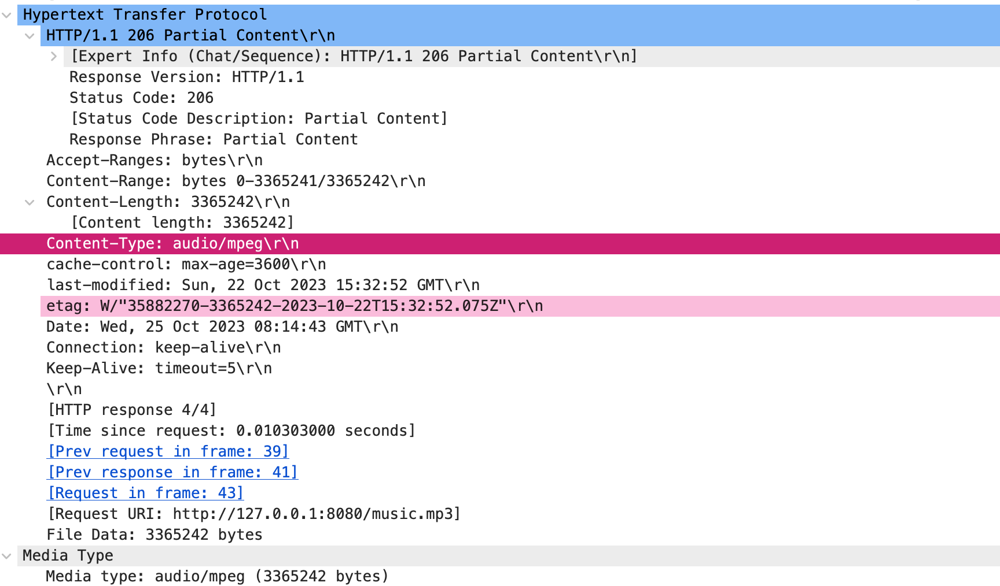
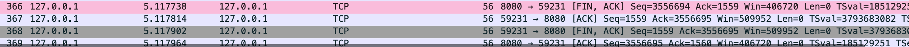

<h1><center>计算机网络实验报告</center></h1>

<h3><center>lab2:配置Web服务器，编写简单页面，分析交互过程</center></h3>

<h5><center>2112614 刘心源</center></h5>

# 一、Web服务器

### 实验环境

系统配置：MacOS（arm64）+Vscode

`http-server` 是一个简单的、零配置的命令行HTTP服务器，它是由Node.js编写的。它非常适合于为前端开发者提供一个快速、简单的方法来运行一个本地Web服务器，以便在开发过程中提供静态文件。

本实验使用`Node.js`中的`http-server`来快速运行一个本地Web服务器:

- 安装`Node.js`

  从[Node.js官方网站](https://nodejs.org/)下载并安装，安装完之后测试：

  ```bash
  node -v
  v18.18.2
  npm -v
  9.8.1
  ```

  安装成功🎉。

- 安装http-server

  ```bash
  sudo npm install -g http-server
  ```

- 在编写的html文件所在的文件夹目录下，使用终端输入`http-server`开启服务

  

- 在浏览器的url中输入`127.0.0.1:8080`，如图：

  


# 二、WireShark抓包

## 1.使用流程

由于在macOS上，捕获循环（loopback）流量可能比在其他系统上更为复杂。macOS的网络架构不允许Wireshark直接捕获循环流量。因此我使用tcpdump+Wireshark的方式进行捕获流量并分析。

### tcpdump

`tcpdump`是一个强大的命令行网络分析工具，它允许用户捕获网络上的数据包以进行实时分析或保存以供以后分析。它是在UNIX和类UNIX操作系统（如Linux和macOS）上广泛使用的工具。以下是`tcpdump`的一些主要特点和用途：

1. **数据包捕获**:
   - `tcpdump`可以捕获通过网络接口传输的数据包。这对于诊断网络问题、分析网络性能或研究网络协议非常有用。
2. **过滤**:
   - `tcpdump`提供了一个强大的过滤语言，允许用户指定要捕获哪些数据包。例如，你可以指定只捕获来自特定IP地址或只捕获特定协议的数据包。
3. **实时分析和保存**:
   - `tcpdump`可以实时显示捕获的数据包，也可以将数据包保存到文件中以便以后分析。
4. **与Wireshark集成**:
   - 虽然`tcpdump`是一个命令行工具，但捕获的数据可以保存到PCAP文件中，然后可以在图形网络分析工具如Wireshark中打开和分析。
5. **协议解析**:
   - `tcpdump`能够解析多种网络协议，显示数据包的详细信息。

在使用`tcpdump`时，通常需要具有管理员或超级用户权限，因为数据包捕获通常需要更高的系统权限。

在本次实验中，我们使用：
```bash
sudo tcpdump -i lo0 -w capture.pcap '(src host 127.0.0.1 and dst host 127.0.0.1) and (port 8080)'
```

将捕获的循环流量保存到`capture.pcap`，并使用`wireshark`打开文件并分析。


## 2.结果分析

### WireShark面板结构


**Frame**: 表示物理层的数据帧，此处表示 Wireshark 在网络上捕获了一个 68 字节（544 位）的数据包。

**Null/Loopback**:表示数据包是在本地回环接口（Loopback Interface）上捕获的。本地回环接口通常用于在同一台计算机上的网络通信测试。

**Internet Protocol Version 4**:互联网IP包的头部信息，表示数据包使用的是 IPv4 协议。

**Transmission Control Protocol**：传输层的数据段头部信息，这里表示数据包使用的是 TCP 协议。


### TCP数据段格式


TCP（传输控制协议）数据段的格式由多个字段组成，这些字段提供了确保可靠传输和数据流控制所需的信息。

1. **源端口（Source Port）（16位）**:
    - 源端口号标识发送数据段的应用程序。它是用于在接收方解协议栈时将数据段路由到正确的应用程序。

2. **目标端口（Destination Port）（16位）**:
    - 目标端口号标识应接收数据段的应用程序。它用于在发送方的协议栈中路由数据段。

3. **序列号（Sequence Number）（32位）**:
    - 序列号用于对数据段进行排序，以确保它们按正确的顺序到达，并允许接收方检测丢失的数据段。

4. **确认号（Acknowledgment Number）（32位）**:
    - 确认号是接收方期望接收的下一个序列号。它通常用于确认已接收的数据。

5. **数据偏移（Data Offset）（4位）** 或 **头部长度（Header Length）**:
    - 数据偏移字段指定了TCP头部的长度。这是必要的，因为TCP头部的长度可能会因选项字段的存在而变化。

6. **保留（Reserved）（3位）**:
    - 保留字段是未使用的，并应设置为零。

7. **标志位（Flags）（9位）**:
    - 控制位用于控制TCP的操作。常见的标志包括SYN（同步）、ACK（确认）、FIN（完成）、RST（重置）、URG（紧急）、PSH（推送）等。

8. **窗口大小（Window Size）（16位）**:
    - 窗口大小字段指定了接收方愿意接收的数据量，以字节为单位。它用于流量控制。

9. **校验和（Checksum）（16位）**:
    - 校验和字段用于检测数据段在传输过程中的错误。

10. **紧急指针（Urgent Pointer）（16位）**:
    - 如果设置了URG标志，则紧急指针字段包含一个值，该值指示紧急数据的结束位置。

11. **选项和填充（Options and Padding）（可变长度）**:
    - TCP头部可以包含可选的额外字段，这些字段用于各种控制和配置目的。选项可能需要额外的填充以保证头部的长度是32位的整数倍。

12. **数据（Data）（可变长度）**:
    - 数据字段包含实际的应用程序数据。其长度取决于数据偏移字段和整个数据段的总长度。


### TCP三次握手

- TCP建立连接的过程称为握手，握手需要在客户和服务器之间交换三个TCP的报文段，称之为三次握手。采用三次握手可以确保了数据传输的顺序性和完整性，是TCP协议可靠性的基础。
- 最开始的时候客户端和服务器都是处于CLOSED状态。主动打开连接的为客户端，被动打开连接的是服务器。


- 步骤：
  1. **SYN（同步）**:
     - 初始阶段，客户端发送一个TCP段，其中设置了SYN（同步）标志，以及一个随机的序列号。这个段的目的是请求服务器建立连接。
  2. **SYN-ACK（同步-确认）**:
     - 服务器收到SYN段后，返回一个SYN-ACK段，确认了客户端的SYN，并自己发送一个SYN。SYN-ACK段包含两个确认号：一个是确认客户端的序列号（客户端序列号+1），另一个是服务器自己的随机序列号。
  3. **ACK（确认）**:
     - 最后，客户端发送一个ACK段，确认服务器的SYN。这个ACK段包含一个确认号，即服务器序列号+1。


- 示意图

  在得到的pcap文件中三次握手对应这三个包


#### 第一次握手


Source Port：59231（客户端）

Destination Port：8080（服务器端）

Sequence Number：0，这是相对的序列号，实际序列号为2448699897

Flags：SYN（同步控制位）

- 一开始TCP的两端都处于`CLOSED`状态
- TCP服务器进程先创建传输控制块TCB，时刻准备接受客户进程的连接请求，此时服务器就进入了LISTEN（监听）状态；
- TCP**客户**进程也是先创建传输控制块TCB，然后向服务器端发出**连接请求报文**
  - 标志位：SYN置为1
  - 初始序列号：seq=2448699897=x
  - 不携带数据，但是需要消耗掉一个序号
- 此后客户端进入**SYN_SENT**阶段，等待服务器端的确认


#### 第二次握手


Source Port：8080

Destination Port：59231

Sequence Number：0，这也是相对序列号，但是实际值与第一次握手的不一样

- 第二次握手的实际序列号为3275643615

Acknowledge Number：1，这也是相对值，实际值为2448699897+1=2448699898，也就是第一次握手的Sequence Number+1

Flags：ACK（确认控制位），SYN（同步控制位）

- TCP服务器端接收到请求报文之后，由标志位SYN=1得知客户端请求建立连接，同意连接则向TCP客户端发出确认报文段：

  - 标志位：ACK和SYN都置为1

  - Sequence Number：初始化一个序列号 seq=3275643615指定服务器端的初始化序列号（注意⚠️：虽然此时的相对序列号与第一次握手的相同，但是实际值并不一样）

  - Acknowledge Number：是客户端发送的seq+1=2448699898

    这是对TCP客户进程选择的初始序号的确认，+1表明服务器已经接收到客户端的SYN段，并且准备好接收从X+1开始的数据。

  - 不携带数据，同样需要消耗掉一个序号

- 此后，服务器端进入**SYS_RCVD**状态


#### 第三次握手


Source Port：59231

Destination Port：8080

Sequence Number：1，是相对值，实际值为2448699898

Acknowledge Number：1，是相对值，实际值为3275643616

Flags：ACK（确认控制位）

- TCP客户进程收到确认后，检查ack是否为x+1，ACK是否为1，如果是则还要向服务器给出确认。
  - 标志位：ACK置为1
  - Sequence Number：置为x+1，对于TCP的客户端来说，发送的第一个TCP报文段的seq 是x并且不携带数据，序列号+1，因此第二个TCP的报文段的序号为x+1
  - Acknowledge Number：服务器端发送的seq+1也就是3275643616
  - 此时可以携带数据
- 客户端进入`ESTABLISH`状态
- 服务器端接收到客户端的TCP数据包之后，检查ack是否为y+1，ACK是否为1，如果是则建立连接成功，完成三次握手进入`ESTABLISHED`状态，此后双方就可以开始通信了QAQ。


### HTTP报文

HTTP报文是面向文本的，报文中的每个字段都是一些 ASCII 码串，各个字段的长度是不确定的。HTTP有两类报文：**请求报文**和**响应报文**。

HTTP 请求/响应报文由以下内容组成：

- 请求头
- HTTP 头部字段
- 空行
- 可选的 HTTP 报文主体数据


#### 请求报文：向Web服务器请求一个动作


HTTP 的请求报文分为三个部分：

- 请求行

  - 请求方法：常见的有**get、post、put、delete**

    HTTP/1.1 协议中共定义了八种方法，以不同的方式操作指定的资源。

    | 方法名  | 功能                                                         |
    | ------- | ------------------------------------------------------------ |
    | GET     | 向指定的资源发出**显示**请求，使用 GET 方法应该只用在 **读取数据** 上，而不应该用于产生 **副作用** 的操作中。 |
    | POST    | 指定资源 **提交数据**，请求服务器进行处理（例如提交表单或者上传文件）。**数据被包含在请求文本中**。这个请求可能会创建新的资源或者修改现有资源，或两者皆有。 |
    | PUT     | 向指定资源位置上传其 **最新内容**。                          |
    | DELETE  | 请求服务器删除 Request-URI 所标识的资源。                    |
    | OPTIONS | 使服务器传回该 **资源支持的所有 HTTP 请求方法**。用 `*` 来代替资源名称，向 Web 服务器发送 OPTIONS 请求，可以测试服务器功能是否正常运作。 |
    | HEAD    | 与 GET 方法一样，都是向服务器发出指定资源的请求，只不过服务器将 **不传回资源的本文部分**，它的好处在于，使用这个方法可以在不必传输全部内容的情况下，就可以获取其中 `关于该资源的信息`（原信息或称元数据）。 |
    | TRACE   | 显示服务器收到的请求，主要用于测试或诊断。                   |
    | CONNECT | HTTP/1.1 中预留给能够将连接改为通道方式的代理服务器。通常用于 SSL 加密服务器的链接（经由非加密的 HTTP 代理服务器）。 |

  - 请求地址 URL：服务器地址后面的部分

  - HTTP 协议版本

  ```http
  GET /index.html HTTP/1.1
  ```

- 请求头

  | 请求头            | 说明                                   |
  | ----------------- | -------------------------------------- |
  | Accept            | 表示浏览器接受的数据类型               |
  | Accept-Encoding   | 表示浏览器接受的数据压缩格式           |
  | Host              | 表示当前请求访问的目标地址             |
  | Authorization     | 表示用户身份认证信息                   |
  | User-Agent        | 表示浏览器类型                         |
  | If-Modified-Since | 表示当前请求资源最近一次更新时间       |
  | If-None-Match     | 表示当前请求资源最近一次标识的 ETag 值 |
  | Cookie            | 表示浏览器保存的 Cookie 信息           |
  | Referer           | 表示标识请求引用自哪个地址             |

- 实体主体

  报文主体包括要发给服务器的数据，是主要数据部分。可以是任意数据类型的数据。


#### 响应报文：将请求的结果返回客户端


- 状态行

  - HTTP 协议版本：常用1.1

  - 状态码

    | 状态码 | 对应信息                                                     |
    | ------ | ------------------------------------------------------------ |
    | 1XX    | 提示信息，表示请求已接收，继续处理                           |
    | 2XX    | 用于表示请求已被成功接收、理解、接收                         |
    | 3XX    | 用于表示资源（网页等）被永久转移到其它 URL，也就是所谓的重定向 |
    | 4XX    | 客户端错误—请求有语法错误或者请求无法实现                    |
    | 5XX    | 服务器端错误—服务器未能实现合法的请求                        |

  - 短语

  ```http
  HTTP/1.0 200 ok
  ```

- 响应头部

  | 名称              | 作用                                   |
  | ----------------- | -------------------------------------- |
  | Date              | 表示当前相应资源发送的服务器日期和时间 |
  | Last-Modified     | 表示当前响应资源最后被修改的服务器时间 |
  | Transfer-Encoding | 表示当前响应资源传输实体的编码格式     |
  | Set-Cookie        | 表示设置 Cookie 信息                   |
  | Location          | 在重定向中或者创建新资源时使用         |
  | Server            | 表示服务器名称                         |

- 响应体

  响应体也就是网页的正文内容，一般在响应头中会用 Content-Length 来明确响应体的长度，便于浏览器接收，对于大数据量的正文信息，也会使用 `chunked` 的编码方式。


🌰举例：

请求报文：

```http
POST hysj.jsp HTTP/1.1
Host: search.cnipr.com
User-Agent: Mozilla/5.0 (Windows;U;Windows NT 6.9;zh-CN;rv:1.9.1.13)Gecko/20100914 Firefox/3.5.13 (.NET CLR 3.5.30729)
Accept: text/html, application/xhtml+xml,application/xml;q=0.9,*/*;q=0.8
Accept-Language: zh-cn,zh;q=0.5
Accept-Encoding: gzip,deflate
Accept-Charst: GN2312,utf-8;q=0.7,*;q=0.7
Keep-Alive: 300
Connection: keep-alive
Referer: http://search.cnipr.com/cnipr/zljs/hyjs-biaodan-y.jsp
Content-Length: 405

pageNo=0&pageSize=10&orderNum=306735659327926273&customerMobile=15626000000&startTime=2019-02-01%2000:00:00&endTime=2019-02-25%2014:54:20&status=SUCCESS&source=WECHAT_SHOPPING&canteenId=104&refundStatus=REFUNDED&startPayTime=2019-02-01%2000:00:00&endPayTime=2019-02-25%2014:54:47
```


响应报文：
```http
HTTP/1.0 200 ok
content-type: application/javascript;charset=utf-8
date: Tue, 07 Mar 2017 03:06:14 GMT
sever: Domain Reliability Searver
content-length: 0
x-xss-protection: 1, mode=bloack
x-frame-options: SAMEORIGIN
alt-svc: quic=":443";ma=2592000;v="36,35,34"
```


在本轮采集的回环流量中有4次HTTP请求应答过程。

#### 第一轮请求应答


##### 客户端先向服务器端发送HTTP请求报文


- 请求行：
  - 请求方式：`GET`
  - 请求URL：/，也就是服务器的根目录
  - 版本协议：1.1
- 请求头：
  - `Host`：主机名，是127.0.0.1:8080
  - `Connection`：`keep-alive`，指示服务器保持TCP连接，不要在响应后关闭它。
  - `sec-ch-ua` 和 `sec-ch-ua-mobile`和`sec-ch-ua-platform`: 是与用户代理字符串有关的新HTTP头。它们提供了浏览器和平台的信息。
  - `User-Agent`:提供了发起请求的浏览器和操作系统的详细信息。这里使用的是发出请求的是运行在`Mac OS X 10.15.7`上的Safari浏览器，版本15.6.1。
  - `Accept`: 描述了客户端接受哪些类型的响应内容。
  - `Sec-Fetch-*`: 这些头部与请求的来源、模式、用户和目的地有关，用于增强安全性。
  - `Accept-Encoding: gzip, deflate`: 表示浏览器支持的内容编码，这里是gzip和deflate压缩。
  - `Accept-Language: zh-CN,zh-Hans;q=0.9`: 告诉服务器，优先返回简体中文内容

在TCP层，客户端发送标志位PSH和ACK，然后服务器端回复ACK表示收到


##### 服务器端发送响应报文


- 状态行：
  - HTTP版本：1.1
  - 状态码：200，请求成功
  - 状态信息：OK😄
- 响应头：
  - `accept-ranges:bytes`: 表示服务器支持范围请求，允许部分传输。通常用于支持断点续传。
  - `cache-control`: 缓存机制，资源在3600秒（60min）内是有效的。
  - `last-modified`: 请求资源的最后修改时间。
  - `etag`: 资源标识符，用于验证缓存版本是否仍然是最新的。
  - `content-length`: 消息主体的大小
  - `content-type: text/html; charset=UTF-8`: 响应内容类型是HTML，并使用UTF-8字符集编码。
  - `Connection`: keep-alive，连接将保持活动状态，不会被关闭。
  - `Keep-Alive`: timeout=5: 持续连接的超时时间是5秒。
  - `File Data`：响应报文的大小
- 主体：
  - `Line-based text data: text/html (24 lines)`: 基于行的文本数据，格式为HTML，共24行。

在TCP层，服务器端发送标志位PSH和ACK，然后客户端回复ACK表示收到


#### 第二轮请求应答


- 大体与第一轮类似，只是这次请求与应答的是图片logo.jpg，因此URL变为 /logo.jpg

  

- 同时我们发现，与第一轮不同的是，客户端发出GET请求后服务器发送了很多数据包。

  - **TCP分段**：TCP将应用层的数据单元（PDU）分为大小适中的段（segment），以便于在网络中传输。这个过程中的每一个段的大小通常不会超过所设置的最大段大小（MSS，Maximum Segment Size）。MSS是一个TCP连接上可以发送的数据的最大量，不包括TCP头部。在这里MSS已经在三次握手时声明为16344。
  
    
  
  - **TCP segment of a reassembled PDU**：如果一个应用层的消息因为太大而被TCP分成了多个段进行发送，那么除了最后一个段之外，其他的段都会被标记为“TCP segment of a reassembled PDU”。这个标记是为了提示接收方，这个段是一个更大消息的一部分，需要进行重新组装。
  
    
  
    
  
  - TCP使用**滑动窗口协议**进行流量控制。`Win`字段就是窗口大小，代表接收方允许发送方发送的未确认的数据的最大量。为了动态调整流量并避免网络拥塞，可能会有多个ACK消息来调整窗口大小。
  
    
  
  - 为了确保数据的完整性和正确性，接收方会发送ACK消息确认已接收的数据。如果发送方没有在一定时间内收到确认，它可能会重发数据。
  
  - 由于网络的不确定性，数据包可能会乱序到达。TCP的序列号（`Seq`字段）确保数据包按正确的顺序被接收和重组。
  
  - **PSH标识**：在TCP协议中，PSH（Push）标识是为了告诉接收方，当它收到一个带有PSH标识的段时，应该立即将这个段的数据交给上层的应用，而不是等待缓冲区填满。这常常用于确保某些时间敏感的数据能够尽快地被处理，例如键盘输入或实时通讯数据。
  
    


-1.jpg)

如上图：

- 客户端发送GET请求之后，服务器首先回应一个ACK表示确认已成功接收到客户端的请求，此时的Len=0；
  - 在TCP协议中，每一段数据（或称为报文段）在发送后都期望得到对方的确认。这种确认机制确保了数据在传输过程中的可靠性。如果发送方在一个预定的超时时间内没有收到确认，它可能会认为数据段在传输过程中丢失，并尝试重新发送。
  - 只有在收到这个确认后，客户端才知道其请求已被成功接收，并期望服务器接下来的响应。

- 黄色部分：
  - 服务器端->客户端的seq=上一个报文中客户端->服务器端的ack
  - 当服务器发送数据给客户端时，它使用的序列号seq表示该数据段的起始字节，在客户端接收到数据之后会回复ACK，此时它的确认号ack是seq+Len，期望下次接收到的数据的第一个字节的序列号。
  - 比如，Frame21中是服务器发送数据给客户端，此时seq为66929，Len=16332，而Frame26中客户端接收服务器的数据后回复的确认号ack就是66929+16632=83261
  - 这样的设计确保了两个方向上的数据传输都是连续的，并允许双方知道对方期望接收的数据的起始位置。通过这种机制，**TCP协议可以在数据段丢失或乱序时，进行重新发送或重新排序，确保数据的可靠传输**。
- 橙色部分：
  - 注意到：1091+16332=17423，17423+16332=33755，33755+16332=50087……
  - 当服务器端->客户端数据分为多次发送的时候，后一次发送的seq是前一次发送的seq+Len
  - 当接收方（客户端）出现一个PSH标识时，则需要将数据尽快交付给接收应用的进程，此后若客户端成功接收，则向服务器端发送ACK，这里的ack=之前发送对应的seq
-  seq 表示数据部分第一个字节的序列号，ack 表示期望接收到对方下一个数据段的第一个字节序列号。且上面的传输过程没有失序、丢失等异常问题。


#### 第三轮请求应答


大部分与传送logo.jpg相似，不同的是最后HTTP的响应报文，此时响应的状态码不是`200 OK`而是`206 Partial Content`。注意到此时应该是音乐文件还没有点击播放的时候，因此服务器仅发送了部分的数据包给客户端。


~~此处有疑问:为什么这里的Media type与URL不匹配~~


#### 第四轮请求应答

第四轮同样是客户端发送GET音频文件的请求，服务器回应`206 Partial Content`。这表示客户端进行了范围请求，并且服务器已成功处理该请求并返回了请求的部分数据。范围请求允许客户端请求资源的一部分，而不是整个资源。这通常在大文件下载过程中中断并需要恢复时或者是流媒体传输中使用。


当客户端发出范围请求时，它在请求头中使用“Range”头字段来指定希望获取的资源的部分。例如：

```http
Range: bytes=0-3365241\r\n
```

在响应时，服务器返回`206 Partial Content`状态码，使用并使用“Content-Range”响应头字段来指明返回数据的范围：



```http
Content-Range: bytes 0-3365241/3365242\r\n
Content-Length: 3365242\r\n
Content-Type: audio/mpeg\r\n
```

这个特性在视频流、大文件下载等场景中特别有用，允许客户端只请求它所需要的数据部分，从而实现断点续传和节省带宽。


### TCP四次挥手

- TCP释放连接的过程叫做挥手，断开连接需要发送四个包，这四个包分别为：主动关闭方的FIN、被动关闭方的ACK、被动关闭方的FIN、以及主动关闭方的ACK。这四个包确保了双方都知道对方已经完成了数据传输并同意断开连接。
- TCP是全双工的，这意味着数据可以在连接的两个方向上同时传输。因此，每个方向都必须单独关闭。这也是为什么即使一个方向上的数据传输已经完成，连接也不会立即关闭。
- 在TCP连接中，客户端和服务器都有能力主动关闭连接。不总是客户端先关闭，服务器也可以主动发起关闭过程。一旦TCP连接被关闭，与之相关的资源（如缓存、变量和其他系统资源）会被释放，这样系统可以重新利用这些资源。在我们的抓包文件中时客户端发起的终止连接。


步骤：

- **FIN: 主动关闭方到被动关闭方**
  - 主动关闭方（想要关闭连接的一方）发送一个TCP段，其中FIN（结束）标志被设置。
  - 这表示主动关闭方已经完成了数据发送，不会再有数据发送到被动关闭方。
- **ACK: 被动关闭方到主动关闭方**
  - 被动关闭方确认接收到了FIN段，发送一个ACK（确认）回应给主动关闭方。
  - 这只是一个确认，被动关闭方可能仍然有数据要发送。
- **FIN: 被动关闭方到主动关闭方**
  - 一旦被动关闭方发送完其所有的数据，它也发送一个带有FIN标志的TCP段给主动关闭方。
  - 这表示被动关闭方也已经完成了数据发送。
- **ACK: 主动关闭方到被动关闭方**
  - 主动关闭方发送最后的ACK段给被动关闭方，确认它已经接收到了被动关闭方的FIN段

示意图如下：



#### 第一次挥手


Source Port：8080（服务器）

Destination Port：59231（客户端）

Sequence Number：3556694，是相对值。实际序列号为3279200309

Acknowledge Number：1559，是相对值，实际值为2448701456

Flags：ACK（确认控制位），FIN（关闭，Finish）

- 数据传输完毕后，双方都可释放连接。最开始的时候，客户端和服务器都是处于`ESTABLISHED`状态。

- 服务器进程发出连接释放报文，并且停止发送数据。
  - 标志：FIN=1，ACK=1
  - 序列号seq=u
  - TCP规定，FIN报文段即使不携带数据，也要消耗一个序号。
- 此时，客户端进入`FIN-WAIT-1`（终止等待1）状态。


#### 第二次挥手


Source Port：59231（服务器）

Destination Port：8080（客户端）

Sequence Number：1559，是相对值。实际序列号为2448701456

Acknowledge Number：3556695，是相对值，实际值为3279200310

Flags：ACK（确认控制位）

- 服务器收到连接释放报文，发出确认报文
  - 标志：ACK=1
  - ack=前面一个报文的seq(u)+1，这是对服务器端发来的报文段的回复
  - 带上自己的序列号seq(v)
- TCP服务器通知高层的应用进程，客户端向服务器的方向就释放了，这时候处于半关闭状态，即客户端已经没有数据要发送了，但是服务器若发送数据，客户端依然要接受。
- 服务端就进入了`CLOSE-WAIT`（关闭等待）状态，这个状态还要持续一段时间，也就是整个`CLOSE-WAIT`状态持续的时间。
- 客户端收到服务器的确认请求后，此时，客户端就进入`FIN-WAIT-2`（终止等待2）状态，等待服务器发送连接释放报文（在这之前还需要接受服务器发送的最后的数据）。


#### 第三次挥手


Source Port：59231（服务器）

Destination Port：8080（客户端）

Sequence Number：1559，是相对值。实际序列号为2448701456

Acknowledge Number：3556695，是相对值，实际值为3279200310

Flags：ACK（确认控制位），FIN

- 服务器将最后的数据发送完毕后，就向客户端发送连接释放报文
  - 标志：FIN=1
  - ack=u+1，和上一个报文一样的，还是对服务器端的回复
  - 本次实验没有发送新的数据，因此seq没有变化
  - 由于在半关闭状态，服务器很可能又发送了一些数据，假定此时的序列号为seq=w
- 服务器就进入了`LAST-ACK`（最后确认）状态，等待客户端的确认。


#### 第四次挥手


Source Port：8080（客户端）

Destination Port：59231（服务器）

Sequence Number：3556695，是相对值。实际序列号为3279200310

Acknowledge Number：1560，是相对值，实际值为2448701457

Flags：ACK（确认控制位）

- 客户端收到服务器的连接释放报文后，必须发出确认
  - 标志：ACK=1
  - ack=上一个报文的seq+1，本次实验中也就是1560+1，如果上一个报文中seq变为w则ack=w+1，这是对服务器发来的报文段的回复
  - seq=u+1
- 客户端就进入了`TIME-WAIT`（时间等待）状态。
- 此时TCP连接还没有释放，必须经过`2*MSL`（最长报文段寿命）的时间后，当客户端撤销相应的TCB后，才进入`CLOSED`状态。
- 服务器只要收到了客户端发出的确认，立即进入`CLOSED`状态。同样，撤销TCB后，就结束了这次的TCP连接。可以看到，服务器结束TCP连接的时间要比客户端早一些。


# 三、一些问题及答案

### Q1：为什么需要等待2*MSL？

A1：MSL（Maximum Segment Lifetime），TCP允许不同的实现可以设置不同的MSL值。
第一，保证客户端发送的最后一个ACK报文能够到达服务器，因为这个ACK报文可能丢失，站在服务器的角度看来，我已经发送了FIN+ACK报文请求断开了，客户端还没有给我回应，应该是我发送的请求断开报文它没有收到，于是服务器又会重新发送一次，而客户端就能在这个2MSL时间段内收到这个重传的报文，接着给出回应报文，并且会重启2MSL计时器。
第二，防止类似与“三次握手”中提到了的“已经失效的连接请求报文段”出现在本连接中。客户端发送完最后一个确认报文后，在这个2MSL时间中，就可以使本连接持续的时间内所产生的所有报文段都从网络中消失。这样新的连接中不会出现旧连接的请求报文。

### Q2：为什么建立连接是三次握手，关闭连接确是四次挥手呢？

建立连接的时候， 服务器在LISTEN状态下，收到建立连接请求的SYN报文后，把ACK和SYN放在一个报文里发送给客户端。
而关闭连接时，服务器收到对方的FIN报文时，仅仅表示对方不再发送数据了但是还能接收数据，而自己也未必全部数据都发送给对方了，所以己方可以立即关闭，也可以发送一些数据给对方后，再发送FIN报文给对方来表示同意现在关闭连接，因此，己方ACK和FIN一般都会分开发送，从而导致多了一次。

